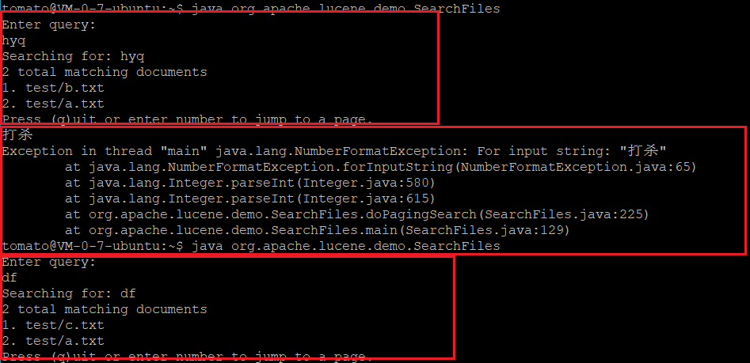

# 使用Lucene实现搜索功能

## 环境

- lucene7.5.0（我们官网上下的是lucene7.7.1，但配置文件里写的是7.5）

## 进度 20190312

要解决的问题：预期根据输入的doc、xls、html等文件建立索引，输入关键词后可得出搜索结果

我搜了几个网上demo来看，感觉我们主要可以进行三方面的工作

- 把输入的不同格式的文件转化为纯文本，网上有htmlparser（java的一个包），正则表达式匹配的方法
    > 官网上说建立索引只支持纯文本
    > Applications that build their search capabilities upon Lucene may 
    > support documents in various formats – HTML, XML, PDF, Word – just to 
    > name a few.
    > Lucene does not care about the *Parsing* of these and other document formats, and it is the responsibility of the 
    > application using Lucene to use an appropriate *Parser* to convert the original format into plain text before passing that plain text to Lucene.

- 编写核心分析器，在这部分有一个最紧急的问题就是需要使用第三方中文分词扩展插件，lucene7自带的标准分词器对中文的分词是按照当个文字分的，比如“腾讯云”,就分成“腾”，“讯”，“云” 三个字,看下图查两个中文字就报错,查当个中文字是可以查出来的,(我没截到图

	

### lucene7扩展中文分词(重点)

- 查找了几个中文分词器，目前最好的就是IK-analyzer，但是这个项目2012年就不再维护了，而且和我们现在的lucene7是不兼容的，教程上说安装lucene 4.10.3可以兼容

- 其他的中文分词器效果不如IK-analyzer，而且也没找到更新维护比较活跃

  所以现在想尝试安装lucene4.10.3+IK-analyzer,好家伙我的pscp和psftp都连不上咱们的服务器,我死活没有把安装包传上去,connect refused

## 参考
- [Lucene 中文分词器 Ik-Analyzer 使用教程](https://blog.csdn.net/wangmx1993328/article/details/82258785)
- [Lucene支持中文分词](https://blog.csdn.net/yerenyuan_pku/article/details/72591778)